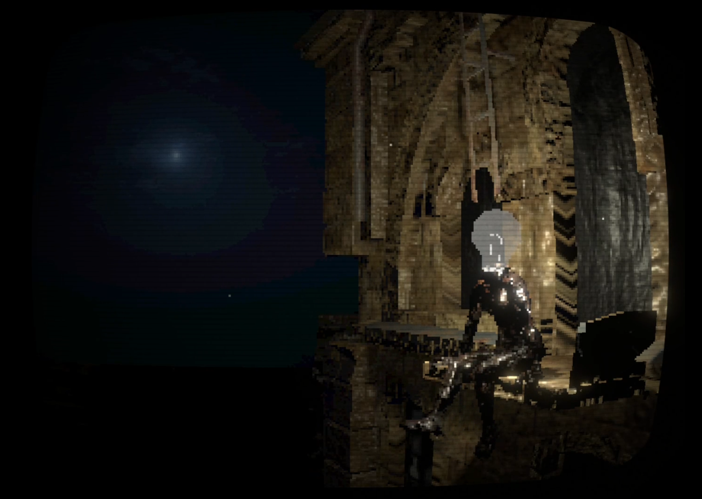

# 60419-Sculpture
Avatar assignment for 60-419 at CMU

## Attributions:
- "Retro CRT Shader (for Universal RP)" shaders   
	(https://github.com/Cyanilux/URP_RetroCRTShader) by @Cyanilux is licensed under the MIT license
- "Cold Night" skybox   
	(https://assetstore.unity.com/packages/2d/textures-materials/sky/allsky-free-10-sky-skybox-set-146014) by rpgwhitelock is licensed under Standard Unity Asset Store EULA
- "Old_flour_mill" building model  
	(https://skfb.ly/6RFMA) by den4ik4irik is licensed under Creative Commons Attribution (http://creativecommons.org/licenses/by/4.0/).
- "Rusty Metal" texture  
	(https://www.freeimages.com/photo/texture-rusty-metal-1525802) by gobran111
- "Night Ambience - December 05" audio  
	(https://freesound.org/people/rgbrobot/sounds/209804/) by rgbrobot licensed under Creative Commons 0
- "Sitting" animation + rigging  
	(https://www.mixamo.com/#/?page=1&query=swinging+legs) by Mixamo
